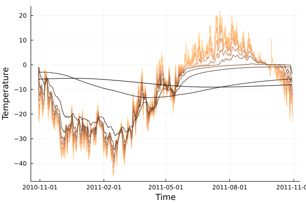
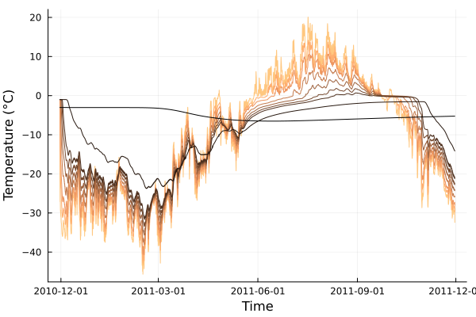

## Quick start

After [installing](installation.md) `CryoGrid.jl`, you can get started right away with a simple soil heat model. The [`Models`](@ref) module (aliased `CryoGridModels`) provides pre-specified models that can be obtained with a single function call. It is also possible to modify the soil and initial temperature profiles via `SoilLayerConfig`; here `SamoylovDefault` is used.

```julia
using CryoGrid
using Plots

# load provided forcing data from Samoylov;
# The forcing file will be automatically downloaded to the input/ folder if not already present.
forcings = loadforcings(CryoGridModels.Forcings.Samoylov_ERA_obs_fitted_1979_2014_spinup_extended_2044, :Tair => u"°C");
# use air temperature as upper boundary forcing
tair = TimeSeriesForcing(ustrip.(forcings.data.Tair), forcings.timestamps, :Tair);
# basic 1-layer heat conduction model (defaults to free water freezing scheme)
model = CryoGridModels.SoilHeat(TemperatureGradient(tair), CryoGridModels.SamoylovDefault)
# define time span (1 year)
tspan = (DateTime(2010,10,30),DateTime(2011,10,30))
# CryoGrid front-end for ODEProblem
prob = CryoGridProblem(model,tspan)
# solve discretized system, saving every 6 hours;
# Trapezoid on a discretized PDE is analogous to the well known Crank-Nicolson method.
out = @time solve(prob, Trapezoid(), abstol=1e-3, reltol=1e-4, saveat=6*3600.0, progress=true) |> CryoGridOutput;
zs = [1.0,5,10,20,30,50,100,500,1000]u"cm"
cg = Plots.cgrad(:copper,rev=true)
plot(out.soil.T[Z(Near(zs))], color=cg[LinRange(0.0,1.0,length(zs))]', ylabel="Temperature", leg=false, dpi=150)
```


Alternatively, we can use a Dall'Amico freeze curve:

```julia
model = CryoGridModels.SoilHeat(TemperatureGradient(tair), SamoylovDefault, freezecurve=SFCC(DallAmico()))
# Set-up parameters
p = copy(model.pproto)
p.soil.α .= 4.0
p.soil.n .= 2.0
p.soil.Tₘ .= 0.0
tspan = (DateTime(2010,10,30),DateTime(2011,10,30))
prob = CryoGridProblem(model,tspan,p)
# stiff solvers don't work well with Dall'Amico due to the ill-conditioned Jacobian;
# We can just forward Euler instead.
out = @time solve(prob, Euler(), dt=120.0, saveat=6*3600.0, progress=true) |> CryoGridOutput;
plot(out.soil.T[Z(Near(zs))], color=cg[LinRange(0.0,1.0,length(zs))]', ylabel="Temperature", leg=false, dpi=150)
```


Note that `SoilHeat` uses energy as the state variable by default. To use temperature as the state variable instead:

```julia
# Note that this will work with any freeze curve, here we use Westermann (2011).
# :T is the variable name for temperature, :H represents enthalpy/energy.
# This is used in the specification of the Heat process type.
model = CryoGridModels.SoilHeat(:T, TemperatureGradient(tair), SamoylovDefault, freezecurve=SFCC(Westermann()))
```
